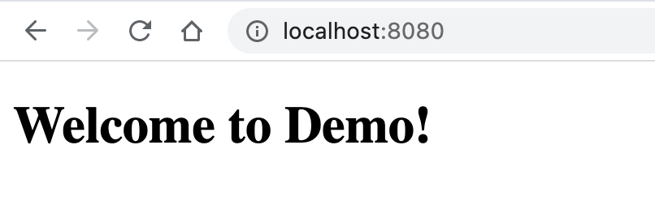
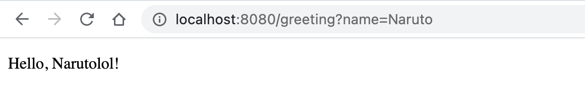
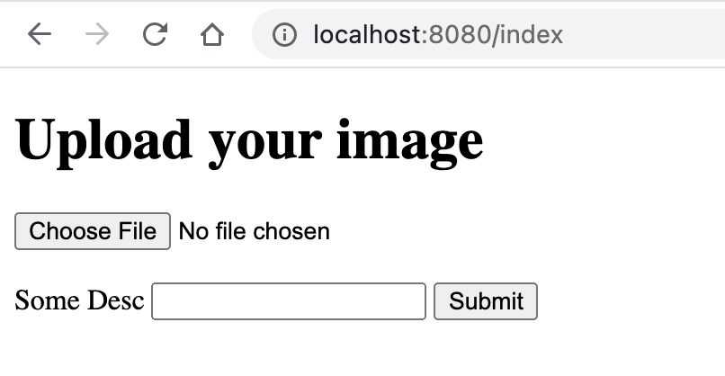
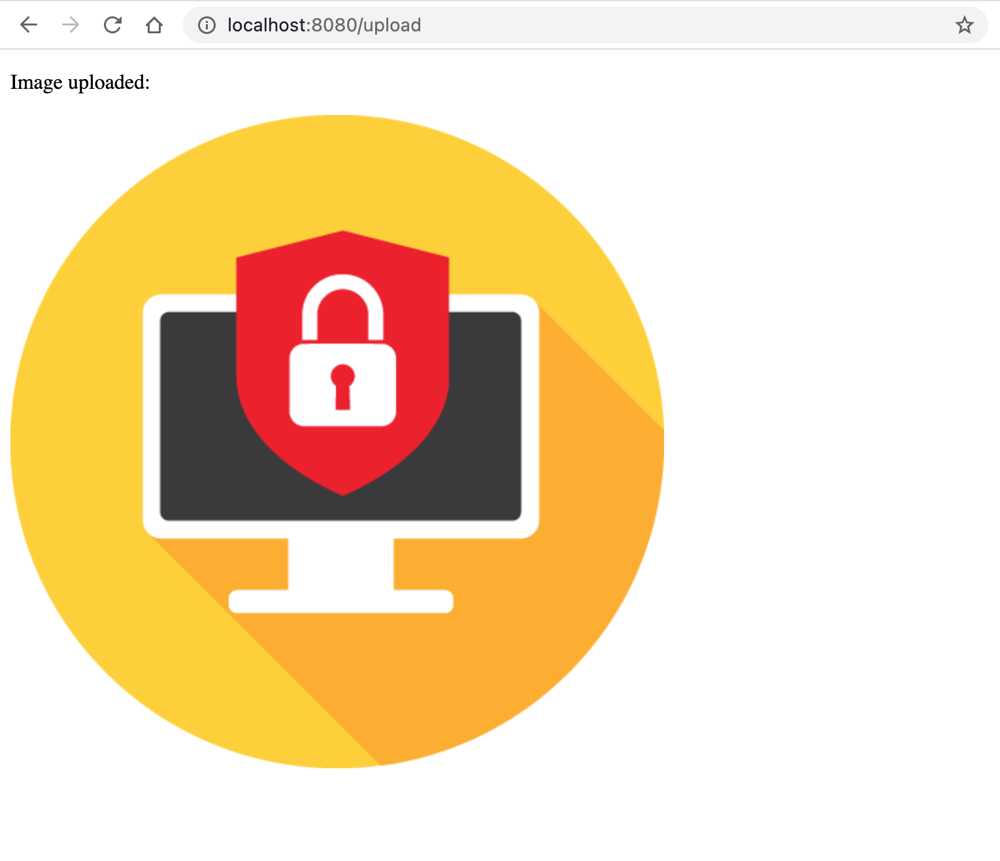
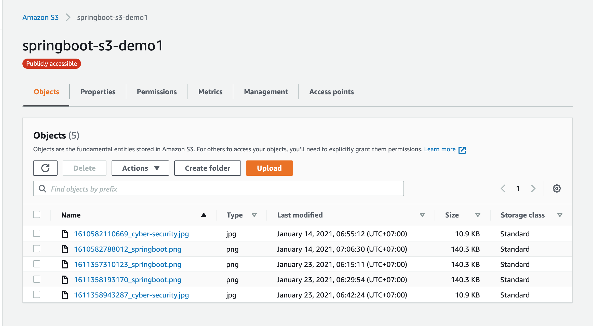

# spring-boot-thymeleaf-aws-s3

### Things to do list:

1. Clone this repository: `git clone https://github.com/hendisantika/spring-boot-thymeleaf-aws-s3.git`
2. Go inside the folder: `cd spring-boot-thymeleaf-aws-s3`
3. Change AWS Access Key & Secret Key in application.yml
4. Run the application: `mvn clean spring-boot:run`

### Images Screen shot

Welcome Page

Greeting Page

Upload Page

Show Image Page

AWS S3 Bucket

